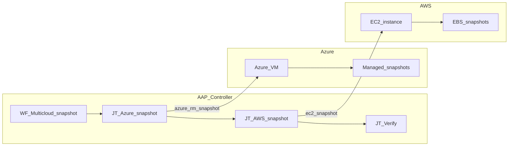

# Multicloud VM Snapshot and Retention Demo


## Introduction

This demo automates **disk snapshot creation and retention** across **Azure** and **AWS** for a customer multicloud PoC (Use Case 2). A single AAP workflow snapshots VMs identified by hostname in both clouds, verifies outcomes, and optionally purges obsolete snapshots.

**Audience:** Platform engineers evaluating AAP for multicloud backup operations with Configuration as Code.

## How to run the demo

| Phase | AAP object | Purpose |
|---|---|---|
| 1 | `WF - Multicloud snapshot and retention` | End-to-end multicloud snapshot workflow |
| 2 | `Snapshot - Azure by hostname` | Azure-only snapshot |
| 3 | `Snapshot - AWS by hostname` | AWS-only snapshot |

1. Apply CasC: see [Quick start](#quick-start).
2. In AAP, open **Templates** → **WF - Multicloud snapshot and retention** → **Launch**.
3. Review job output for snapshot IDs in each cloud.

## Environment / prerequisites

- AAP 2.6+, Azure VM, AWS EC2, cross-cloud API connectivity from AAP.
- See [docs/setup.md](docs/setup.md) for roles, service principals, and EE build steps.

## Quick start

```bash
cd artifacts/demos/aap-demo-multicloud-snapshots
ansible-galaxy collection install -r collections/requirements.yml -p collections
cp ansible.cfg.example ansible.cfg
cp group_vars/all/demo_variables.yml.example group_vars/all/demo_variables.yml
cp vault.yml.example vault.yml && ansible-vault encrypt vault.yml
ansible-playbook playbooks/aap_config.yml --vault-id @prompt
```

## Scenario overview

| Challenge | AAP approach |
|---|---|
| Different APIs per cloud | Certified `azure.azcollection` and `amazon.aws` modules |
| Consistent operational workflow | Workflow template chaining Azure → AWS → verify |
| Reproducible platform config | `infra.aap_configuration` CasC for all AAP objects |
| Multicloud inventory UX (UC4) | Parent `Demo-Multicloud` inventory with Azure/AWS children |

## Architecture



## Multicloud inventory UX (UC4)

```
Demo-Multicloud
├── Azure-Resources
│   └── azure_vms (Azure demo VM)
└── AWS-Resources
    └── aws_vms (AWS demo VM)
```

CasC in `group_vars/all/inventories.yml` defines the hierarchy. Re-running `playbooks/aap_config.yml` reproduces inventory structure from Git—the source of truth for AAP objects in this PoC.

## Repository map

| Path | Purpose |
|---|---|
| `playbooks/demo/` | Snapshot, verify, and cleanup automation |
| `playbooks/aap_config.yml` | Apply CasC to AAP |
| `group_vars/all/` | CasC variable definitions |
| `context/execution-environment.yml` | Optional custom EE |
| `docs/` | Setup, procedures, verification |

## Job templates

| Job template | Playbook | Credentials |
|---|---|---|
| Snapshot - Azure by hostname | `playbooks/demo/snapshot_azure.yml` | Azure SP |
| Snapshot - AWS by hostname | `playbooks/demo/snapshot_aws.yml` | AWS IAM |
| Snapshot - Verify | `playbooks/demo/snapshot_verify.yml` | Azure SP, AWS IAM |
| Snapshot - Cleanup (optional) | `playbooks/demo/snapshot_cleanup.yml` | Azure SP, AWS IAM |

## Workflow templates

| Workflow | Nodes |
|---|---|
| WF - Multicloud snapshot and retention | Azure snapshot → AWS snapshot → Verify → Cleanup (optional) |

## Collections

| Collection | Tier | Purpose |
|---|---|---|
| infra.aap_configuration | validated | AAP Configuration as Code |
| azure.azcollection | certified | Azure VM and snapshot modules |
| amazon.aws | certified | EC2 and EBS snapshot modules |

## References

- `knowledge/patterns/aap-as-code.md` (workbench)
- Red Hat AAP 2.6 documentation
- Azure Application Gateway and AWS EBS snapshot product docs
